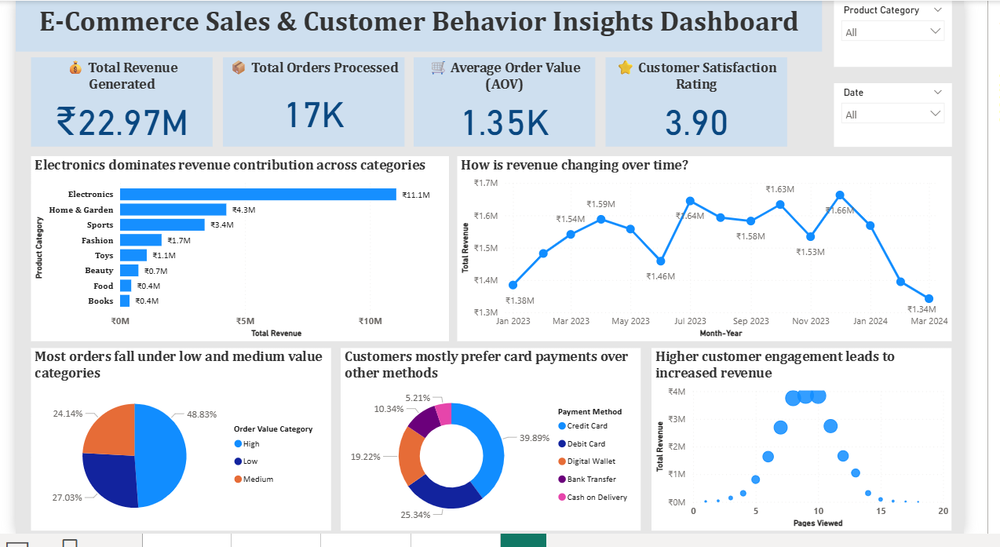

# 🛒 E-Commerce Sales & Customer Behavior Insights Dashboard

An interactive Power BI dashboard analyzing e-commerce sales performance, customer behavior patterns, and payment trends to support data-driven business decisions.

---

## 📊 Dashboard Preview



---

## 📌 Problem Statement

E-commerce platforms generate massive volumes of transactional data daily, but raw data alone is not useful for decision-making. Business teams struggle to identify:
- Which product categories drive the most revenue
- How revenue fluctuates across months and seasons
- What payment methods customers prefer
- How customer engagement (pages viewed) impacts revenue
- Whether order values are concentrated in high or low segments

This dashboard converts raw transactional data into clear, actionable business insights.

---

## 🎯 Objectives

- Measure total revenue, orders processed, and average order value (AOV)
- Identify top-performing and underperforming product categories
- Analyze monthly revenue trends and detect seasonal patterns
- Understand customer payment method preferences
- Explore the relationship between customer engagement and revenue
- Track customer satisfaction scores across the business

---

## 📂 Dataset

| Detail | Info |
|--------|------|
| **Domain** | E-Commerce Sales & Customer Behavior |
| **Records** | 17,000+ order records |
| **Time Period** | January 2023 – March 2024 |
| **Coverage** | Orders, revenue, payment methods, customer ratings, product categories |

**Key Fields:**
`Order ID` · `Product Category` · `Total Sales` · `Payment Method` · `Pages Viewed` · `Customer Rating` · `Delivery Time` · `Order Date`

---

## 🛠️ Tools Used

| Tool | Purpose |
|------|---------|
| **Power BI** | Dashboard building & interactive visualizations |
| **DAX** | Calculated measures and KPIs |
| **Power Query** | Data cleaning & transformation |
| **Excel** | Initial data preparation |

---

## 📈 Key KPIs

| KPI | Value |
|-----|-------|
| **Total Revenue Generated** | ₹22.97M |
| **Total Orders Processed** | 17K |
| **Average Order Value (AOV)** | ₹1.35K |
| **Customer Satisfaction Rating** | 3.90 / 5 |

---

## 🔢 DAX Measures Used

```DAX
-- Total Revenue
Total Revenue = SUM('Orders'[Total Sales])

-- Total Orders
Total Orders = COUNTROWS('Orders')

-- Average Order Value
AOV = DIVIDE([Total Revenue], [Total Orders], 0)

-- Customer Satisfaction Rating
Avg Rating = AVERAGE('Orders'[Customer Rating])

-- Monthly Revenue
Monthly Revenue =
CALCULATE(
    [Total Revenue],
    DATESMTD('Orders'[Order Date])
)

-- Revenue by Category
Revenue by Category =
CALCULATE(
    [Total Revenue],
    ALLEXCEPT('Orders', 'Orders'[Product Category])
)
```

---

## 💡 Key Insights

- 💰 **Electronics dominates revenue** — contributing ₹11.1M out of ₹22.97M total (48% of all revenue), making it the single most important category
- 🏡 **Home & Garden is a strong #2** — at ₹4.3M, followed by Sports at ₹3.4M; Fashion, Toys, and Beauty significantly lag behind
- 📅 **Revenue fluctuates month to month** — peaks visible at May 2023 (₹1.59M), July 2023 (₹1.64M), and November 2023 (₹1.63M), suggesting seasonal demand spikes
- 📉 **Sharp revenue drop in early 2024** — revenue fell to ₹1.34M in March 2024, the lowest point in the entire period — requires urgent investigation
- 💳 **Credit card is the dominant payment method** — at 39.89%, followed by Debit Card (25.34%), Digital Wallet (19.22%), Bank Transfer (10.34%), and Cash on Delivery (5.21%)
- 🛍️ **Most orders fall in low and medium value categories** — Low (48.83%), Medium (27.03%), High (24.14%) — showing most customers make smaller purchases
- 📱 **Higher page views correlate with increased revenue** — customers who view more pages tend to generate higher revenue, confirming engagement drives conversion

---

## 🎨 Dashboard Visuals

| Visual | Insight Shown |
|--------|--------------|
| **KPI Cards** (top row) | Total Revenue · Orders · AOV · Customer Rating |
| **Horizontal Bar Chart** | Revenue by product category — Electronics leads at ₹11.1M |
| **Line Chart** | Monthly revenue trend Jan 2023 – Mar 2024 |
| **Pie Chart** | Order value category split (High / Low / Medium) |
| **Donut Chart** | Payment method distribution — Credit Card 39.89% |
| **Scatter Plot** | Pages viewed vs total revenue — engagement impact |
| **Slicers** | Product Category + Date interactive filters |

---

## 🏢 Business Recommendations

1. **Double down on Electronics** — with 48% revenue share, increasing electronics inventory, running targeted promotions, and improving delivery speed in this category will have the highest ROI
2. **Investigate the March 2024 revenue drop** — the sharp decline to ₹1.34M needs immediate root cause analysis; check for supply chain issues, competitor activity, or seasonal effects
3. **Capitalize on seasonal peaks** — May, July, and November show consistent revenue spikes; pre-plan marketing campaigns, stock levels, and offers around these months
4. **Promote digital wallets and UPI** — Cash on Delivery at only 5.21% shows digital payment adoption is high; further incentivizing digital wallets can reduce return rates and improve cash flow
5. **Convert low-value customers to medium/high** — with 48.83% of orders in the low value segment, targeted upselling strategies (bundles, recommendations, loyalty rewards) can significantly increase AOV
6. **Improve engagement for low page-view customers** — scatter plot shows higher engagement = higher revenue; invest in personalization and product recommendation features

---

## 📁 Repository Structure

```
ecommerce-powerbi/
│
├── README.md                          ← Project documentation
├── dashboard.png                      ← Dashboard screenshot
└── ECommerce_Sales_Dashboard.pbix     ← Power BI file
```

---

## 🚀 How to View

**Option 1 — Power BI Published Link**
👉 *(Publish to Power BI Service and paste your link here)*

**Option 2 — Local**
1. Download `ECommerce_Sales_Dashboard.pbix` from this repo
2. Open with [Power BI Desktop](https://powerbi.microsoft.com/en-us/desktop/) (free)

---

## 👤 Author

**Abhin Gulam**
- 💼 [LinkedIn Profile](linkedin.com/in/abhin-gulam-a2737a313)
- 🐙 [GitHub](https://github.com/abhingulam)

---

`Power BI` `E-Commerce Analytics` `Sales Dashboard` `DAX` `Customer Behavior` `Data Visualization` `Business Intelligence` `Dashboard` `Data Analytics Portfolio`
